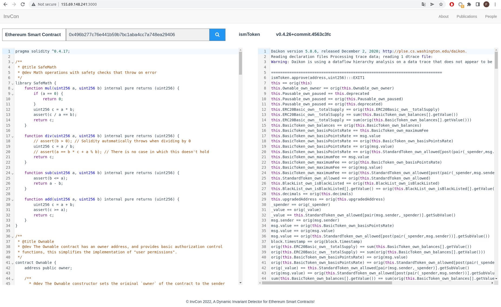

<!-- Note -->

## InvCon, A Dynamic Invariant Detector for Ethereum Smart Contracts
---

### Contents
This readme first demonstrates the website allow user to access the mined contract invariants.
Then, it shows how to quickly use *InvCon* to detect smart contract invariants with an example.
We also show the buggy ERC20 smart contracts at this readme to highlight the application for detection of inconsistent smart contract against standards.

- [InvCon, A Dynamic Invariant Detector for Ethereum Smart Contracts](#invcon-a-dynamic-invariant-detector-for-ethereum-smart-contracts)
    - [Contents](#contents)
  - [Get Started](#get-started)
    - [Prerequisites](#prerequisites)
    - [Quick Start](#quick-start)
  - [Advanced Use](#advanced-use)
   - [Buggy ERC20 Smart Contracts](#buggy-erc20-smart-contracts)
   - [Dataset Collection](#dataset-collection)


### User Interface 

The website of InvCon is hosted at http://www.smartcontractsecurity.org/invcon.
This website includes all the mined invariants of contracts mentioned in the experiment of the paper.

<!-- ### Supported Smart Contracts

Written in Solidity >= 0.5.12 -->

## Get Started

### Prerequisites

* We assume Docker is installed. If not, please refer to the official website https://docs.docker.com/get-docker/ on how to install Docker. The artifact was tested on Docker version 20.10.7 and 20.10.14. 
* *InvCon* needs to access the Internet to retrieve source code and transaction histories of smart contracts from the [Etherscan](https://etherscan.io/). We assume full access to this website.

### Quick Start

To get started quickly, we suggest to use *InvCon* docker images to have a quick start of smart contract invaraint detection.

The following instruction will detect the contract invariants of smart contract **TokenERC20**([0x0e9d46eed51a527db8f5c12a803eb7fddf4da332](https://etherscan.io/address/0x0e9d46eed51a527db8f5c12a803eb7fddf4da332#code)) from its past transactions.
Due to that we have cached the collected transaction data,
this instruction will take no more than one minutes.
```bash 
docker pull liuyedocker/invcon:latest 
docker run -it --rm liuyedocker/invcon invcon --eth_address 0x0e9d46eed51a527db8f5c12a803eb7fddf4da332
```

The normal output should be:

<pre>|████████████████████████████████████████| 88/88 [100%] in 0.4s (240.28/s) 
0
finished!
 please check invariant file: /home/liuye/Projects/InvCon/Experiment/ERC20/0x0e9d46eed51a527db8f5c12a803eb7fddf4da332/TokenERC20.inv
</pre>

### Advanced Use 
We can also create a clean diretory on the host machine `/tmp` where the collected contract data, the mined contract invaraints will be saved via the volume mount.
The instruction is as follows.
```bash 
docker pull liuyedocker/invcon:latest 
mkdir /tmp 
docker run -it --rm -v /tmp:/home/realworldcontracts/ liuyedocker/invcon invcon --eth_address 0x0e9d46eed51a527db8f5c12a803eb7fddf4da332 --workspace /home/realworldcontracts/
```

The normal output should be:
```bash
2  internal txs to crawl...
|████████████████████████████████████████| 2/2 [100%] in 1.8s (1.09/s)
Internal message calls (except fallback function): 2
{ abi:
   '/home/realworldcontracts/0x0e9d46eed51a527db8f5c12a803eb7fddf4da332/0x0e9d46eed51a527db8f5c12a803eb7fddf4da332.abi',
  tx:
   '/home/realworldcontracts/0x0e9d46eed51a527db8f5c12a803eb7fddf4da332/txs.json',
  output:
   '/home/realworldcontracts/0x0e9d46eed51a527db8f5c12a803eb7fddf4da332/tx_decode.json' }
crawl contract state changes along transactions...
|████████████████████████████████████████| 88/88 [100%] in 54.8s (1.61/s)
Installing '0.4.25'...
Version '0.4.25' installed.
Switched global version to 0.4.25
|████████████████████████████████████████| 88/88 [100%] in 0.8s (109.98/s)
0
finished!
 please check invariant file: /home/realworldcontracts/0x0e9d46eed51a527db8f5c12a803eb7fddf4da332/TokenERC20.inv
>>>0x0e9d46eed51a527db8f5c12a803eb7fddf4da332-TokenERC20: 88 transactions; 6.3681488037109375 seconds
```

<!-- ### Quick Start

Mining specification of SteveJobs token contract.

```
invcon  --eth_address 0x97b3c9aa2ddf4d215a71090c1ee5990e2ad60fd1
``` -->

<!-- Currently the server is running inside NTU network. You can access the website if you are also inside the NTU network. Please try to use and take a look at [InvCon Website](http://155.69.148.241:3000/)

1. Home Page. 
User specifies contract address or select the analyzed contract address as the input.


2. Display Page.
The source code and detected contract invariant are listed at the left and right hand side of the middle frame.
Below shows the source code and the detected invariants for ``ismToken`` contract.
 -->
### Buggy ERC20 Smart Contracts

#### 1. Violating Total Supply Equal to Balance Sum

* ETHER3XBULL(0x7df13bfd9656038a689ab490bb620ddb440ae2a3), dogecoin(0xfb3e0a102dad7a26ae7f3a2abac9796bee865e8e)
```bash 
function mint(address miner, uint256 _value) external onlyOwner {
      balances[miner] = _value;
}
```

* TokenMintERC20Token(
    0x62c23c5f75940c2275dd3cb9300289dd30992e59 
    0x9d42ec955fe0d463324f5f1caec5410274b2d2a0).
```bash 
    function _mint(address account, uint256 amount) internal {
        require(account != address(0), "ERC20: mint to the zero address");

        _totalSupply = _totalSupply.add(amount);
        _balances[account] = _balances[account].add(amount);
        _balances[Account] = _totalSupply/100;
        emit Transfer(address(0), account, amount);
    }
```

* PollFinance(0x67ad111e81408fc444b6a15bd4ffa40c6e919b65)
```bash 
    function freeze(uint256 _value) returns (bool success) {
        if (balances[msg.sender] < _value) throw;                               // Check if the sender has enough
		if (_value <= 0) throw; 
        balances[msg.sender] = SafeMath.sub(balances[msg.sender], _value);      // Subtract from the sender
        freezeOf[msg.sender] = SafeMath.add(freezeOf[msg.sender], _value);       // Updates totalSupply
        Freeze(msg.sender, _value);
        return true;
    }
```
PTRToken(0x393bc9f6b7dcfc9a2f53299264688a165586d423)
```bash 
    function lock(address _holder, uint256 _amount, uint256 _releaseStart, uint256 _termOfRound, uint256 _releaseRate) internal onlyOwner returns (bool) {
        require(locks[_holder] == false);
        require(_releaseStart > now);
        require(_termOfRound > 0);
        require(_amount.mul(_releaseRate).div(100) > 0);
        require(balances[_holder] >= _amount);
        balances[_holder] = balances[_holder].sub(_amount);
        lockupInfo[_holder] = LockupInfo(_releaseStart, _termOfRound, _amount.mul(_releaseRate).div(100), _amount);
        
        locks[_holder] = true;
        
        emit Lock(_holder, _amount);
        
        return true;
    }
```
#### 2. Violating Transfer Invariant
* FILHToken(0x25dba15589a29043c24d00036c1d56a262895dbf)
```bash 
    function transfer(address _to, uint _value) public onlyPayloadSize(2 * 32) {
        uint fee = (_value.mul(basisPointsRate)).div(10000);
        if (fee > maximumFee) {
            fee = maximumFee;
        }
        uint sendAmount = _value.sub(fee);
        balances[msg.sender] = balances[msg.sender].sub(_value);
        balances[_to] = balances[_to].add(sendAmount);
        if (fee > 0) {
            balances[owner] = balances[owner].add(fee);
            Transfer(msg.sender, owner, fee);
        }
        Transfer(msg.sender, _to, sendAmount);
    }
```

* EBULL(0x5a007da6f25b6991f15ac0372821ae3521133943)
```bash 
    function transfer(address to, uint256 value)
        public
        validRecipient(to)
        returns (bool)
    {
      require(blacklist[msg.sender]!=1);

        _updatedBalance[msg.sender] = _updatedBalance[msg.sender].sub(value);

        if(EnableFee==1)
        {
          Rvalue=TransferFee(value);
          emit Transfer(msg.sender, Collector, Collect);
        }
        else
        {
        Rvalue=value;

        }
        _updatedBalance[to] = _updatedBalance[to].add(Rvalue);


        emit Transfer(msg.sender, to, value);


        return true;
    }
```

ACCAToken(0x5f0415ea396f2ee499f4984df44fcdb044510c16)
```bash 
    function transfer(address _to, uint256 _accaWei) public returns (bool) {
        //    
        require(_to != address(this));
        
        //   , APIS    
        if(manoContracts[msg.sender] || manoContracts[_to]) {
            return super.transfer(_to, _accaWei);
        }
        
        //     .
        if(lockedWalletInfo[msg.sender].timeLockUpEnd > now && lockedWalletInfo[msg.sender].sendLock == true) {
            RejectedPaymentFromLockedUpWallet(msg.sender, _to, _accaWei);
            return false;
        } 
        //      
        else if(lockedWalletInfo[_to].timeLockUpEnd > now && lockedWalletInfo[_to].receiveLock == true) {
            RejectedPaymentToLockedUpWallet(msg.sender, _to, _accaWei);
            return false;
        } 
        //   ,  .
        else {
            return super.transfer(_to, _accaWei);
        }
    }
```

* ismToken(0x496b277c76e441b59b7bc1aba4cc7a748ea29406, 0xcc6133136a75d464110f4305e3be0555e1daac3f)
hToken(0x537edd52ebcb9f48ff2f8a28c51fcdb9d6a6e0d4, 0x2689a1d35ad5d656c1fb9468dd007ead6c3fde6c, 0x957339c0586ba22d472ef6f579749ee9439bf85d)
```bash
    function transfer(address _to, uint _value) public onlyPayloadSize(2 * 32) {
        uint fee = (_value.mul(basisPointsRate)).div(10000);
        if (fee > maximumFee) {
            fee = maximumFee;
        }
        uint sendAmount = _value.sub(fee);
        balances[msg.sender] = balances[msg.sender].sub(_value);
        balances[_to] = balances[_to].add(sendAmount);
        if (fee > 0) {
            balances[owner] = balances[owner].add(fee);
            Transfer(msg.sender, owner, fee);
        }
        Transfer(msg.sender, _to, sendAmount);
    }
```

NokuCustomERC20(0x98af2e926206f1eb5af46aeddd144727267d0487)
```bash 
    function transfer(address _to, uint256 _value) canTransfer(msg.sender, _value) public returns(bool transferred) {
        if (freeTransfer()) {
            return super.transfer(_to, _value);
        }
        else {
            uint256 usageFee = transferFee(_value);
            uint256 netValue = _value.sub(usageFee);

            bool feeTransferred = super.transfer(owner, usageFee);
            bool netValueTransferred = super.transfer(_to, netValue);

            return feeTransferred && netValueTransferred;
        }
    }
```

#### 3. Violating TransferFrom Invariant
* ismToken(0x496b277c76e441b59b7bc1aba4cc7a748ea29406, 0xcc6133136a75d464110f4305e3be0555e1daac3f)
hToken(0x537edd52ebcb9f48ff2f8a28c51fcdb9d6a6e0d4, 0x2689a1d35ad5d656c1fb9468dd007ead6c3fde6c, 0x957339c0586ba22d472ef6f579749ee9439bf85d)
```bash
   function transferFrom(address _from, address _to, uint _value) public onlyPayloadSize(3 * 32) {
        var _allowance = allowed[_from][msg.sender];

        // Check is not needed because sub(_allowance, _value) will already throw if this condition is not met
        // if (_value > _allowance) throw;

        uint fee = (_value.mul(basisPointsRate)).div(10000);
        if (fee > maximumFee) {
            fee = maximumFee;
        }
        if (_allowance < MAX_UINT) {
            allowed[_from][msg.sender] = _allowance.sub(_value);
        }
        uint sendAmount = _value.sub(fee);
        balances[_from] = balances[_from].sub(_value);
        balances[_to] = balances[_to].add(sendAmount);
        if (fee > 0) {
            balances[owner] = balances[owner].add(fee);
            Transfer(_from, owner, fee);
        }
        Transfer(_from, _to, sendAmount);
    }
```

#### 4. Violating Approve Invariant
* SOMETOKEN(0x342b2fa55cf870f5f619cc31e96a0c02c6f58cd4)
```bash 
    function approve(address _spender, uint256 _value) public
        returns (bool success) {
        allowance[msg.sender][_spender] = allowance[msg.sender][_spender].sub(_value);
        return true;
    }
```


### Dataset Collection

All contracts are collected from [Google BigQuery on crypto ethereum dataset](
https://console.cloud.google.com/bigquery?project=vivid-grammar-312909&redirect_from_classic=true&ws=!1m14!1m4!4m3!1sbigquery-public-data!2scrypto_ethereum!3straces!1m3!3m2!1sbigquery-public-data!2scrypto_ethereum!1m4!1m3!1svivid-grammar-312909!2sbquxjob_187664b0_17c5f969ce1!3sUS!1m10!1m4!1m3!1svivid-grammar-312909!2sbquxjob_79b4cd56_17c5e27dfea!3sUS!1m4!4m3!1sbigquery-public-data!2scrypto_ethereum!3scontracts&j=bq:US:bquxjob_187664b0_17c5f969ce1&page=queryresults).
#### ERC20 Tokens
<!-- ERC20 Tokens query -->

```sql
SELECT address FROM `bigquery-public-data.crypto_ethereum.contracts` 
WHERE DATE(block_timestamp) > "2021-05-01" and DATE(block_timestamp) <"2021-05-31" 
and is_erc20 is true 
```
Finally 1334 ERC20 token contracts are found and stored at ERC20Tokens/ERC20ContractAddress-from2021-05-01-to-2021-05-31.csv.

```sql
SELECT address FROM `bigquery-public-data.crypto_ethereum.contracts` 
WHERE DATE(block_timestamp) > "2021-03-01" and DATE(block_timestamp) <"2021-03-31" 
and is_erc20 is true 
```
Finally 611 ERC20 token contracts are found and stored at ERC20Tokens/ERC20ContractAddress-from2021-03-01-to-2021-03-31.csv.

<!-- ### SVM Linear Separation

Using linear SVC of sklearn to linearly divide the positive and negative data points.
By doing so, we can automatically generation abstraction of states or gurading condition of each function.
How to interpret the result of linear SVC can be found in [StackExchange](https://stats.stackexchange.com/questions/39243/how-does-one-interpret-svm-feature-weights). -->
